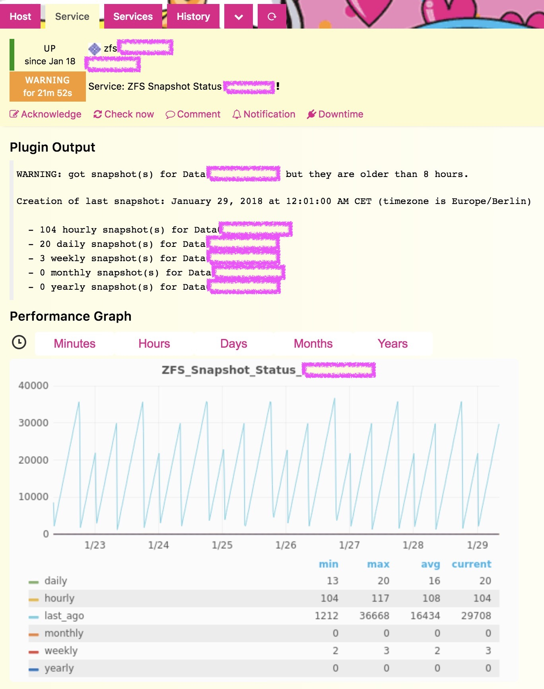
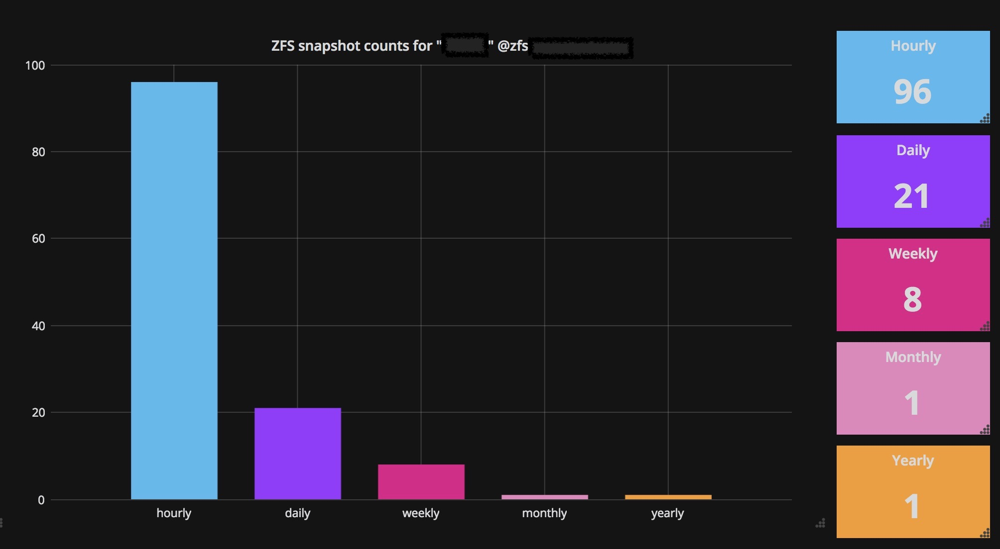

# icinga2-plugin-zfssnapshots
Check and count ZFS snapshots as well as check their age

This is a small check plugin I wrote for our ZFS file storages.
* **Tested on Solaris only.**
* That's why GNU tools are **hardcoded**. This may change in further releases.
* Perhaps, it will be working on Linux as well after some changes, but I never tested that - in fact, we have no ZFS on Linux at all.
* It runs in production on our servers, and it is written for them - status **worksforme** ;) As the community asked me, I provide it here, but you'll be probably not able to use it without further intervention.

### Usage
```
zfs_snapshots.sh [ -c <critical_hours> ] [ -w <warning_hours> ] -d <dataset>
  -c : Optional: CRITICAL snapshot age in hours (default: 12h)
  -d : dataset to check
  -w : Optional: WARNING snapshot age in hours (default: 6h)
```

### Example
```
./zfs_snapshots.sh -d Data01/archives
OK: got snapshot(s) for Data01/archives within the last 6 hours.
Creation of last snapshot: January 18, 2018 at 10:15:00 AM CET (timezone is Europe/Berlin)

  - 40 hourly snapshot(s) for Data01/archives
  - 7 daily snapshot(s) for Data01/archives
  - 3 weekly snapshot(s) for Data01/archives
  - 1 monthly snapshot(s) for Data01/archives
  - 1 yearly snapshot(s) for Data01/archives
|last_ago=641;21600;43200;0;43200; hourly=40;;;;; daily=7;;;;; weekly=3;;;;; monthly=1;;;;; yearly=1;;;;;
```

### Screenshots
This is a sample of a `WARNING` output in Icinga Web 2.


You can process your performance data and create cool Grafana dashboards; I'm using templating, so every admin can explicitly select ZFS server and needed dataset on it.

